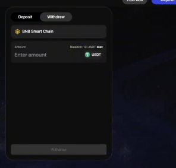
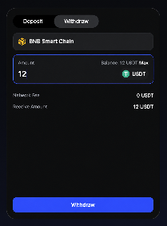

# How do I withdraw crypto from HashLiquid?

Use **Withdraw** to transfer USDT from your HashLiquid Account via BNB Chain. Before confirming, check the account or wallet shown for the transfer.

## Before you begin

* Check the account or wallet displayed on the withdrawal page. Depending on how you accessed HashLiquid, the page may show **Binance Funding Wallet**, **HashLiquid Account**, or **Connected Wallet**.
* Make sure the receiving account or wallet shown supports USDT via BNB Chain.
* Make sure your HashLiquid balance covers the withdrawal amount and any fee shown.


**Important:** On-chain transfers normally cannot be reversed. Check the asset, network, amount, and connected wallet before confirming.


## Withdraw crypto



**Open Withdraw**

Sign in to HashLiquid and select **Withdraw**.



**Check the tab**

Make sure the **Withdraw** tab is selected.



**Check the asset and network**

Confirm that the asset is **USDT** and the network is **BNB Chain**.



**Enter the amount**

Enter the amount, or select **Max** to use the available balance.

<figure><figcaption>
Enter a withdrawal amount
</figcaption></figure>



**Review the fee**

Review the **Network Fee** and **Receive Amount**.

<figure><figcaption>
Review the fee and receive amount
</figcaption></figure>



**Select Withdraw**

Select **Withdraw**.



**Confirm the request**

Complete the confirmation requested on screen. A wallet-connected user may also be asked to approve the request in the connected wallet.



## Check the withdrawal status

Open the account menu, select **Transaction History**, and open the relevant withdrawal. The status may remain **Processing** while the network and HashLiquid update the transaction.

Do not submit the same withdrawal again while it is **Processing**. If it remains unresolved, [contact HashLiquid Support](../troubleshooting-and-support/contact-hash-support.md) with the asset, amount, network, and submission time. Include the transaction hash or ID if one is available.


HashLiquid Support will never ask for your password, private key, or recovery phrase.


## Related articles

* [How do I deposit crypto to HashLiquid?](deposit-crypto.md)
* [What should I do if my deposit or withdrawal is delayed or failed?](../troubleshooting-and-support/delayed-transfers.md)
