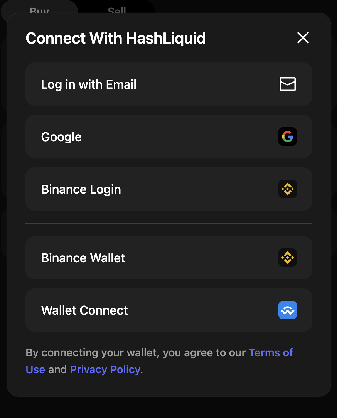
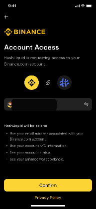
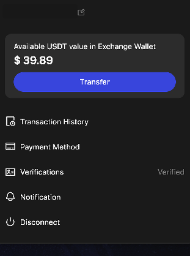
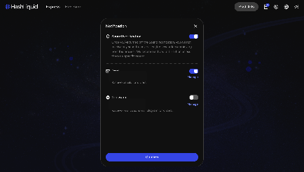

# How do I access HashLiquid?

You can access HashLiquid with email, Google, Binance Login, Binance Wallet, or a supported wallet through WalletConnect. Choose the method linked to the account or wallet you want to use for trading.

## Choose how to access HashLiquid

1. Open HashLiquid and select the connection or login option.
2. Choose **Log in with Email**, **Google**, **Binance Login**, **Binance Wallet**, or **Wallet Connect**.
3. Follow the on-screen prompts for the method you selected. Email and Google users complete the sign-in prompts shown by HashLiquid; Binance and wallet users may also need to authorize the connection.

<figure><figcaption>
HashLiquid access options
</figcaption></figure>

## Access with Binance Login

1. On the HashLiquid access page, select **Binance Login**.
2. Review the account and permissions shown on the Binance authorization page.
3. Select **Confirm** to continue to HashLiquid.


Only approve the request if you recognize HashLiquid and the Binance Account shown on the page.


<figure><figcaption>
Review Binance authorization
</figcaption></figure>

## Access with Binance Wallet or WalletConnect

1. Select **Binance Wallet** or **Wallet Connect** on the HashLiquid access page.
2. If you selected **Wallet Connect**, choose an available wallet.
3. Approve the connection request in your wallet, then return to HashLiquid.


Connecting a wallet never requires you to share your recovery phrase or private key.


## Where can I find my account features?

After you sign in, select the **account** icon in the upper-right corner. From the account menu, you can access:

* **Edit nickname** (the pencil icon next to your name)
* **Deposit** and **Withdraw**
* **Transaction History**
* **Payment Method**
* **Verifications**
* **Notification**
* **FAQ**
* **Disconnect**

<figure><figcaption>
HashLiquid account menu
</figcaption></figure>

### Set up order notifications

To choose how you receive order alerts, open **Notification** and enable **Sound Notification**, **Email**, or **Telegram**.


Keep at least one channel enabled while you have an active P2P order.


<figure><figcaption>
Notification settings
</figcaption></figure>

## Related articles

* [How do I complete identity verification on HashLiquid?](identity-verification.md)
* [How do I add, edit, or remove a Payment Method?](payment-methods.md)
