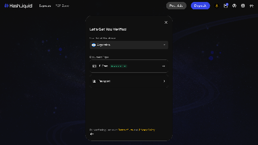
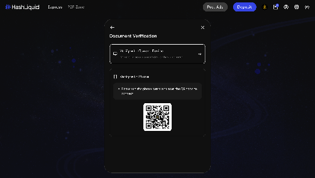
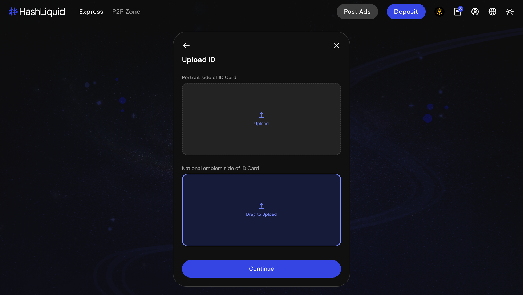
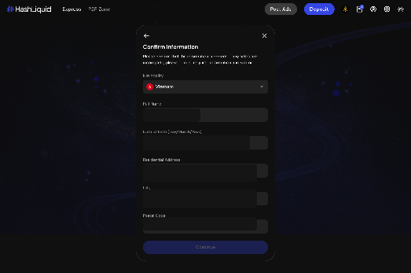
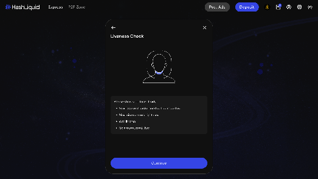
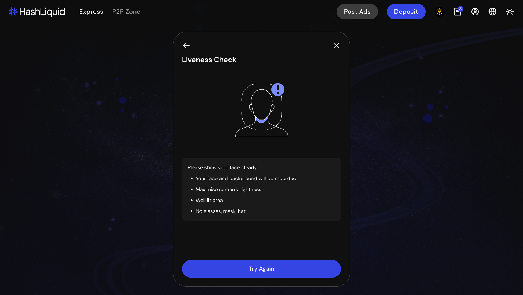

# How do I complete identity verification on HashLiquid?

Complete identity verification from **Verifications** in your account menu. Prepare a valid ID Card or Passport and use a device with a working camera.

## Complete identity verification



**Open your account menu**

Sign in to HashLiquid and select the **account** icon.



**Open Verifications**

Select **Verifications**.



**Choose your country and document**

Select your **Country of Residence** and document type.

<figure><figcaption>
Select country and identity document
</figcaption></figure>



**Choose a verification device**

Choose **Verify with Current Device**, or select **Verify with Phone** and scan the QR code.

<figure><figcaption>
Choose verification device
</figcaption></figure>



**Upload your document**

Follow the on-screen instructions to upload your document. If you use an ID Card, upload both requested sides.


Make sure the document is clear, complete, and belongs to you.


<figure><figcaption>
Upload identity document
</figcaption></figure>



**Confirm your information**

Review the information extracted from your document. Complete any required fields, then select **Continue**.

<figure><figcaption>
Confirm identity information
</figcaption></figure>



**Complete the liveness check**

Complete the liveness check by following the actions shown on screen.

<figure><figcaption>
Complete liveness check
</figcaption></figure>




After submission, HashLiquid will check your information. You can close the window and return to **Verifications** later to check the status.


## If the liveness check is unsuccessful

Select **Try Again**, then:

* Move to a well-lit area.
* Remove glasses, a mask, or a hat.
* Keep your full face inside the camera frame.

<figure><figcaption>
Retry liveness check
</figcaption></figure>

## Related articles

* [How do I add, edit, or remove a Payment Method?](payment-methods.md)
* [How do I buy crypto on HashLiquid?](../p2p-trading/buy-crypto.md)
