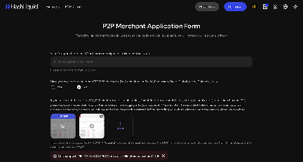
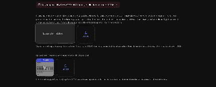
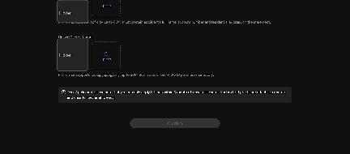

# How do I apply to become a HashLiquid Merchant?

You must become a HashLiquid Merchant before you can post Advertisements. Select **Post Ads** to open the **P2P Merchant Application Form**.

## What do I need to provide?

Prepare:

- [ ] Your Telegram username
- [ ] Information about your previous OTC or P2P trading experience
- [ ] A recording of your trading history, if requested by the form
- [ ] An identity declaration video
- [ ] A bank statement covering the last three months
- [ ] Both sides of your photo ID


Use clear, accurate files that belong to you. Follow the declaration text and file requirements shown on the application form.


## Submit your application



**Open the application form**

Sign in to HashLiquid and select **Post Ads**.



**Enter your Telegram username**

Enter your Telegram username in the format shown on the page.



**Share your trading experience**

Confirm whether you have traded on another OTC or P2P platform.

<figure><figcaption>
Telegram username and prior P2P trading experience
</figcaption></figure>



**Upload your trading history (if required)**

If required, upload a recording showing your account and historical trading activity on that platform.



**Record your identity declaration**

Upload a video of yourself holding the front of your ID and reading the declaration shown on the form.



**Upload your bank statement**

Upload a bank statement for the last three months. It must show your full name, account number, and residential address.

<figure><figcaption>
Identity declaration video and bank statement uploads
</figcaption></figure>



**Upload your photo ID**

Upload both sides of your photo ID.

<figure><figcaption>
Photo ID upload and application limit
</figcaption></figure>



**Confirm**

Review the application, then select **Confirm**.




You can submit up to three Merchant applications within three months. Check every file carefully before selecting **Confirm**.


## After you apply

Submission does not guarantee approval. After the review, HashLiquid will contact you through the Telegram username provided. If approved, you can access CIPHER to manage Advertisements, orders, Disputes, and your Merchant Funding Account.

## Related articles

* [How do I complete identity verification on HashLiquid?](../getting-started/identity-verification.md)
* [How do I add, edit, or remove a Payment Method?](../getting-started/payment-methods.md)
