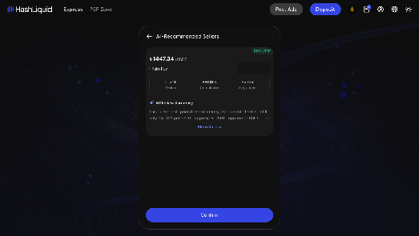
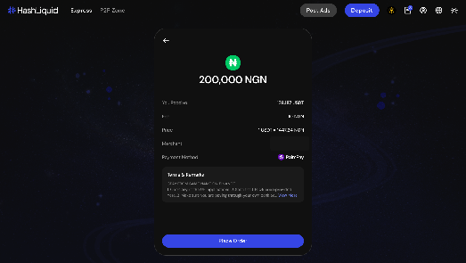
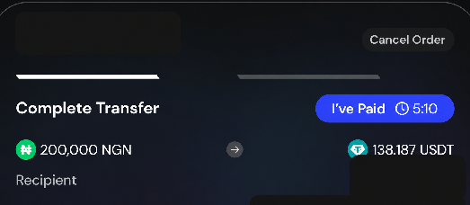
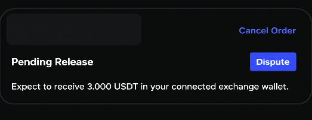

# How do I buy crypto on HashLiquid?

You can buy crypto through **Express** or the **P2P Zone**. Before placing an order, check the price, order limits, Payment Method, and the advertiser's terms.

## Place a buy order





**Open Express**

Sign in to HashLiquid and select **Express** > **Buy**.



**Enter the amount**

Enter the fiat amount you want to **Spend** or the crypto amount you want to **Receive**.



**Choose how to pay**

Under **Pay Using**, select an available Payment Method.



**Find an Advertisement**

Select **Select Ads**.

<figure><figcaption>
Select an Advertisement
</figcaption></figure>



**Review the Advertisement**

Review the matched Advertisement, including its price, Merchant, limits, Payment Method, fee, and **Terms & Remarks**.



**Place the order**

Select **Place Order**.

<figure><figcaption>
Confirm a buy order
</figcaption></figure>







**Open the P2P Zone**

Select **P2P Zone** and open **Buy**.



**Set your filters**

Select the fiat currency, crypto, and Payment Method you want to use.



**Choose an Advertisement**

Choose an Advertisement that supports your order amount.



**Enter the amount**

Enter the amount and review the advertiser's limits and terms.



**Place the order**

Select **Place Order**.





## Complete your buy order



**Send the payment**

Open the order and use the payment details shown to transfer the exact amount through your payment provider.



**Mark the order as paid**

Upload payment proof if requested, then select **Mark as Paid** only after the transfer has been submitted successfully.

<figure><figcaption>
Complete payment
</figcaption></figure>



**Wait for the release**

Wait for the seller to confirm receipt and release the crypto.

<figure><figcaption>
Order pending release
</figcaption></figure>



**Check your balance**

Check the completed order and your updated balance.




Do not cancel an order after you have paid. Do not send payment to an account that is different from the one shown in the order. If the seller does not release the crypto after receiving payment, use the order chat and [raise a Dispute](../troubleshooting-and-support/disputes.md) when available.


## Related articles

* [How do I view and manage my P2P orders?](manage-orders.md)
* [What should I do if there is a payment or crypto-release problem?](../troubleshooting-and-support/payment-release-problems.md)
