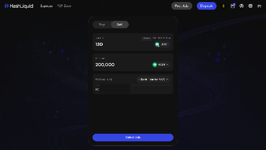
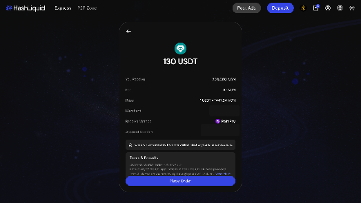

# How do I sell crypto on HashLiquid?

You can sell crypto through **Express** or **P2P Zone** and receive payment through a [Payment Method](../getting-started/payment-methods.md) added to your HashLiquid account.


**Important:** Release crypto only after you have confirmed that the full payment has arrived in your own bank or payment account. Do not rely only on a screenshot or the buyer's payment notification.


## Place a sell order





**Open Express**

Sign in to HashLiquid and select **Express** > **Sell**.



**Enter the amount**

Enter the crypto amount you want to **Spend** or the fiat amount you want to **Receive**.



**Choose where to get paid**

Under **Receive Using**, select the account where you want to receive payment. If you do not have an available account, select **Add Account** first.



**Find an Advertisement**

Select **Select Ads**.

<figure><figcaption>
Enter a sell amount
</figcaption></figure>



**Review the Advertisement**

Review the matched Advertisement, including the price, Merchant, Payment Method, receiving account, fee, and **Terms & Remarks**.



**Place the order**

Select **Place Order**.

<figure><figcaption>
Confirm a sell order
</figcaption></figure>







**Open the P2P Zone**

Select **P2P Zone** and open **Sell**.



**Set your filters**

Select the fiat currency, crypto, and Payment Method you want to use.



**Choose an Advertisement**

Choose an advertisement that supports your order amount.



**Enter the amount**

Enter the amount you want to sell and select your receiving account.



**Place the order**

Review the advertiser's limits and terms, then select **Place Order**.





## Complete your sell order



**Wait for the buyer to pay**

Wait for the buyer to make payment. You can contact the buyer through the order chat if needed.



**Confirm the payment arrived**

After the buyer marks the order as paid, open your bank or payment-provider account and confirm that the full payment has arrived.



**Release the crypto**

Return to HashLiquid and select **Release Crypto**.



**Complete the security check**

Review the confirmation and complete the required security check.



If you accessed HashLiquid with Binance Login, releasing crypto may trigger Binance MFA. If you connected a wallet, approve the release in that wallet when prompted.


**Do not release crypto if:**

* You have not received the payment;
* The amount is incomplete;
* The payment details do not match the order; or
* The payment appears to have come from an unexpected account.

Use the order chat and [raise a Dispute](../troubleshooting-and-support/disputes.md) if the issue cannot be resolved.


## Related articles

* [How do I add, edit, or remove a Payment Method?](../getting-started/payment-methods.md)
* [What should I do if there is a payment or crypto-release problem?](../troubleshooting-and-support/payment-release-problems.md)
