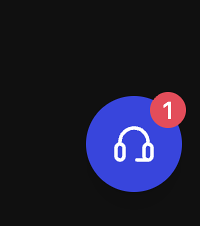
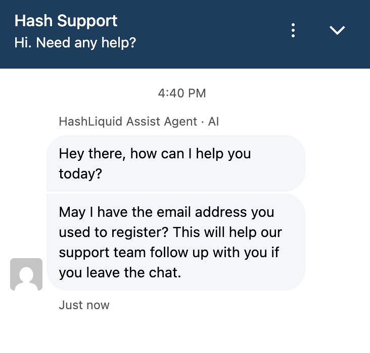

# Contact Hash Support

Select the headset icon on HashLiquid to open Hash Support.

<figure><figcaption>
Open Hash Support
</figcaption></figure>

Enter the email address used for your HashLiquid account when requested so the team can follow up if you leave the chat.

<figure><figcaption>
Chat with Hash Support
</figcaption></figure>


**Support hours:** Hash Support reviews requests from 7:00 AM to 5:00 PM (UTC+8). This is the review window, not a guaranteed resolution time.


## Have these details ready

* The transfer or order type (deposit, withdrawal, buy, or sell)
* The asset, amount, and network
* The time you submitted it
* The transaction hash or ID, if available


**Security reminder:** HashLiquid Support will never ask for your password, private key, or recovery phrase.


## Related articles

* [What should I do if my deposit or withdrawal is delayed or failed?](delayed-transfers.md)
* [How do I open and manage a Dispute?](disputes.md)
