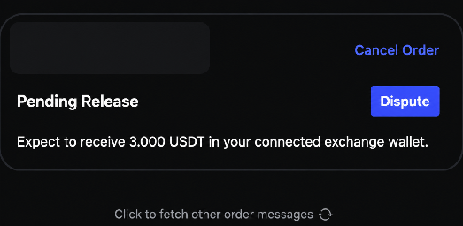
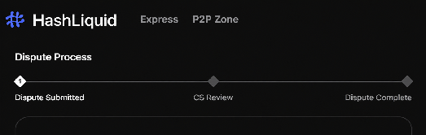
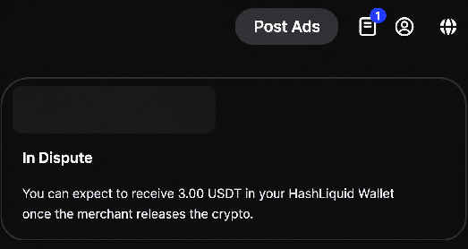

# How do I open and manage a Dispute?

Open a **Dispute** when a P2P order problem cannot be resolved with the counterparty through the order chat.

## Before opening a Dispute

1. Keep the order open.
2. Check the payment or crypto-release status.
3. Explain the problem to the counterparty in the order chat.
4. Prepare clear evidence relevant to the order.


**Evidence may include** a payment receipt, payment-account transaction record, or screen recording showing the amount, recipient, time, and payment status.


## Open a Dispute



**Open the order**

Open the relevant order.



**Select Dispute**

Select **Dispute** when the button becomes available.

<figure><figcaption>
Open Dispute from the order
</figcaption></figure>



**Choose a reason**

Choose the reason that best matches the problem.



**Add details and evidence**

Describe what happened and upload the requested evidence.



**Submit**

Review the information and submit the Dispute.



## What happens next?

The Dispute page shows the review progress. HashLiquid Customer Support may review the order details, order chat, and evidence provided by both parties.


**Review hours:** Hash Support reviews Disputes from 7:00 AM to 5:00 PM (UTC+8). This is the support review window and does not guarantee that a Dispute will be resolved within the same day.


<figure><figcaption>
Dispute review stages
</figcaption></figure>

If HashLiquid requests more information, return to the Dispute and submit it before the deadline shown on the page.


Crypto related to the order remains frozen until the Dispute is resolved.


<figure><figcaption>
Order in dispute
</figcaption></figure>

## Cancel a Dispute

Cancel a Dispute only if the payment or crypto-release issue has been fully resolved. Open the Dispute and select **Cancel Dispute** if that action is available.


Upload only evidence relevant to the order. Never provide a password, verification code, private key, or recovery phrase.


## Related articles

* [What should I do if there is a payment or crypto-release problem?](payment-release-problems.md)
* [Contact Hash Support](contact-hash-support.md)
